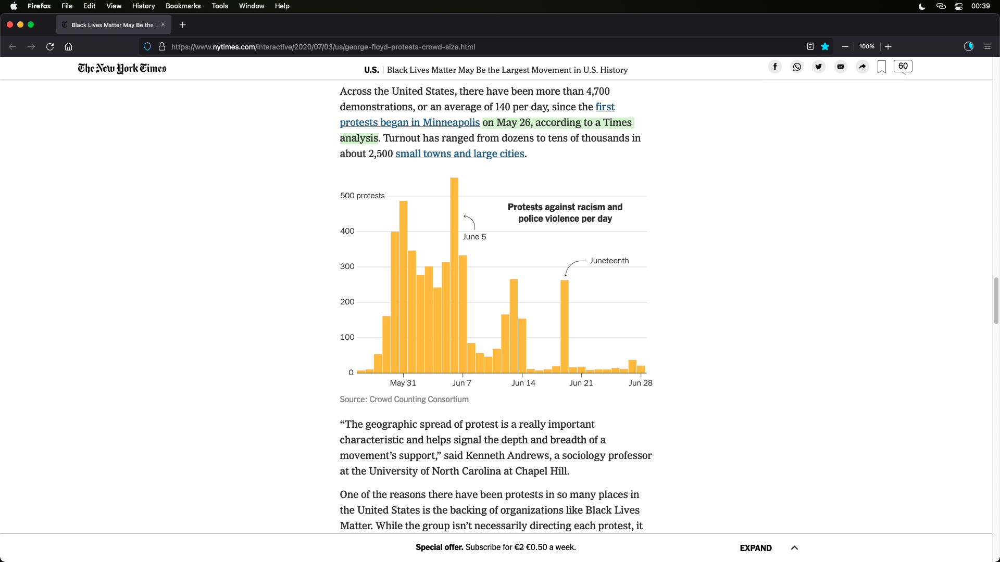

# PolicesViolence for DataScience
Repository for the project of the course Data Science (Fondamenti di Scienza dei Dati) at UniUD.

All the project is made in Italian language.

## Repository
* analisys.R è esattamente lo stesso codice della presentazione salvo il markdown, usato per comodità per test vari
* Presentation-PolicesViolence.Rmd è il file Rmd usato per la creazione della presentazione per l'esame

## Dataset: 
 link: https://fatalencounters.org/
 >`(tools> download complete dataset)`

 Quello utilizzato (scaricato il 30/12/2021) è nella repository (fatalEncountersDotOrg.csv)

## Info sources

* **Inizio proteste** il NewYorkTimes afferma verso fine maggio (https://www.nytimes.com/interactive/2020/07/03/us/george-floyd-protests-crowd-size.html)

* **Dati sulla popolazione**
	- https://www.pewresearch.org/social-trends/fact-sheet/facts-about-the-us-black-population/?menuItem=a10c1812-3110-463e-b262-5d4eb21167b3
	- https://en.wikipedia.org/wiki/African_Americans#Demographics
	- https://blackdemographics.com/
	- https://en.wikipedia.org/wiki/White_Americans#Demographic_information

